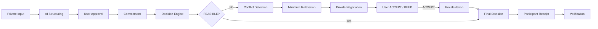
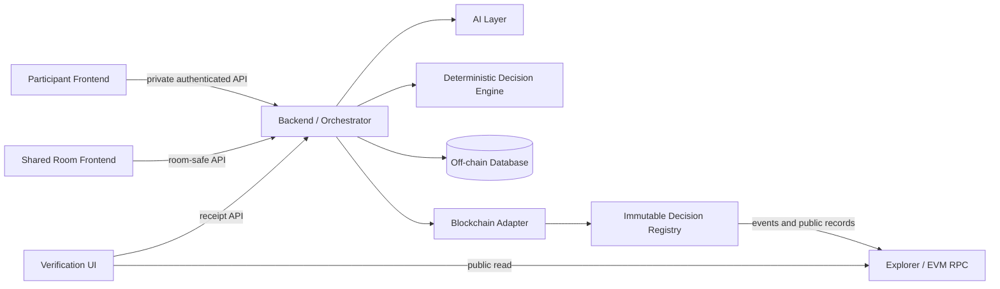

# HUSH

> **HUSH는 서로의 비밀을 밝히지 않고 합의하는 AI 협상 시스템입니다.**

**비밀은 지키고, 반영됐다는 사실은 증명한다.**

Track: **Web3 기반 사회문제 해결**

HUSH는 여러 사람이 함께 장소, 일정, 역할처럼 하나의 결정을 내려야 할 때, 각자의 민감한 조건을 필요 이상 공개하지 않고 합의를 찾도록 돕습니다. AI는 이해와 설명을 돕고, 결정은 규칙에 따라 계산되며, 참여자는 자신이 승인한 입력이 결과에 연결되었는지 검증할 수 있습니다.

## Problem

함께 결정할 때는 보통 조건을 많이 공개할수록 조율이 쉬워집니다. 하지만 예산, 접근성, 식이, 돌봄, 일정 같은 조건에는 다른 사람에게 설명하고 싶지 않은 개인적 이유가 있을 수 있습니다.

- 조건을 존중받으려면 민감한 사유까지 공개해야 하는가?
- 조건이 충돌하면 누가, 얼마나 양보해야 하는가?
- AI가 결론을 대신 내린다면 그 결과를 왜 신뢰해야 하는가?

HUSH는 이 문제를 다음 세 축으로 다룹니다.

**Private Negotiation** + **User Control** + **Independent Verification**

## 핵심 아이디어

### Private Negotiation

각 participant의 raw private Constraint와 개인 사유는 다른 participant에게 공개하지 않습니다. 충돌이 생겨도 **Minimum Necessary Disclosure** 원칙에 따라 합의에 필요한 최소한의 정보만 사용하고, 상세 proposal은 대상 participant의 private surface로만 전달합니다.

### User Control

AI는 자연어를 structured Constraint 후보로 바꾸고 이해하기 쉽게 설명하지만, 이를 확정하거나 조건을 변경하지 않습니다. 사용자가 직접 내용을 확인하며, relaxation이 필요할 때도 당사자가 `ACCEPT` 또는 `KEEP`을 선택합니다.

### Independent Verification

HUSH는 단순히 “정상적으로 계산했다”는 서버의 주장에 의존하지 않습니다. Commitment와 Participant Receipt를 통해 승인된 입력, 사용된 후보 dataset, Decision Engine identity, 최종 결정의 provenance와 integrity evidence를 확인할 수 있습니다.

Blockchain은 AI가 옳은 판단을 했음을 증명하는 도구가 아닙니다. 승인된 입력과 최종 결정이 어떤 provenance를 갖는지 운영자와 독립된 public record로 검증할 수 있게 하는 역할입니다.

## How It Works



1. participant가 private input을 제출합니다.
2. AI가 supported schema의 structured Constraint 후보를 만들고, 사용자가 확인합니다.
3. 승인된 조건의 Commitment를 만들고 Decision Engine이 후보를 계산합니다.
4. 해가 없으면 conflict를 내부적으로 분석하고, 필요한 relaxation proposal을 해당 participant에게만 전달합니다.
5. 사용자가 `ACCEPT`하면 변경된 조건으로 실제 recalculation을 수행합니다.
6. final decision과 Participant Receipt를 통해 결과와 evidence를 확인합니다.

## 역할 분리

| Component | Responsibility |
|---|---|
| User | Constraint를 확인하고 relaxation을 `ACCEPT` / `KEEP`한다. |
| AI | 자연어를 구조화하고, 해석 및 협상 메시지를 설명한다. |
| Decision Engine | deterministic constraint evaluation, feasibility, conflict, ranking, final selection을 계산한다. |
| Backend / Orchestrator | lifecycle, authorization, persistence, component orchestration, receipt 조립을 담당한다. |
| Blockchain | Commitment와 decision provenance evidence를 immutable public record에 남긴다. |
| Participant Receipt | participant가 자신의 입력과 public record를 비교해 검증할 수 있게 한다. |

> **AI는 협상을 돕지만 최종 결정 권한을 가지지 않습니다.**

AI는 User Approval 없이 Constraint를 바꾸지 않으며, Backend도 Engine의 feasibility·score·selection을 바꾸지 않습니다. Decision Engine은 계산만 담당하고 승인이나 on-chain 변경을 수행하지 않습니다.

## Demo Scenario

대표 Demo는 4명이 저녁 식사 장소를 정하는 상황입니다.

| Participant | Private condition | 역할 |
|---|---|---|
| A | `max_price <= 15000` (`HARD`) | 가격 상한 |
| B | 음식 종류 관련 `SOFT` preference | 선호 반영 |
| C | 접근성 관련 constraint 또는 preference | 접근성 반영 |
| D | 종료 시간 관련 `HARD` constraint | 시간 제한 |

초기 계산은 `NO FEASIBLE SOLUTION`입니다. candidate/Constraint evaluation에서 conflict와 representative relaxation target을 식별하고, A에게만 다음 proposal을 보여 줍니다.

```text
A.max_price
15000 → 17000
[ACCEPT] [KEEP]
```

A가 `ACCEPT`하면 변경된 Constraint로 Decision Engine을 다시 실행하여 `FEASIBLE` 여부와 deterministic Final Decision을 실제로 계산합니다. Participant Receipt와 verification까지 이어집니다. 다른 participant에게 A의 raw private Constraint, 원값, proposal 상세 또는 개인 사유는 공개하지 않습니다.

Pre-Screening Demo에서는 generalized numeric minimum-relaxation search를 정상 Engine path로 사용합니다. 안정성이 확보되지 않은 경우에는 fixture로 검증된 위 representative proposal만 fallback으로 사용하며, 이를 general-purpose solver로 표현하지 않습니다. 이 경우에도 `NO FEASIBLE SOLUTION`, `FEASIBLE`, conflict status, selected candidate, Final Decision은 실제 Decision Engine 계산을 유지하며 결과 전체를 고정하지 않습니다.

## System Architecture

아래 그림은 설명을 위한 요약입니다. canonical architecture와 데이터·신뢰 경계는 [architecture 문서](docs/architecture/README.md)를 기준으로 합니다.



Participant Frontend, Shared Room Frontend, Verification UI는 서로 다른 목적과 visibility를 가집니다. Shared Room에는 aggregate-safe status만 제공하며, private input과 proposal detail은 owner-authorized off-chain path에만 남습니다.

## Privacy & Trust

- Raw private Constraint와 private reason은 다른 participant에게 공개하지 않습니다.
- Minimum Necessary Disclosure를 적용하며, shared view에는 private conflict의 상세·owner·값을 표시하지 않습니다.
- AI output은 schema validation과 User Confirmation 전까지 trusted Engine input이 아닙니다.
- Final Decision은 deterministic Decision Engine이 계산합니다.
- Blockchain에는 raw private input, `constraint_value`, salt, private reason을 기록하지 않습니다.
- Commitment는 승인된 조건 version과 최종 decision provenance를 연결합니다.
- Participant Receipt는 participant가 public record와 evidence를 비교하는 독립 검증 경로를 제공합니다.

HUSH는 완전한 trustless system이나 Blockchain에 의한 Engine correctness proof를 주장하지 않습니다. P0의 목표는 raw data를 공개하지 않으면서 입력·코드 identity·결과의 provenance를 검증 가능하게 만드는 것입니다.

## Project Scope

### P0 — 핵심 구현 범위

7주 P0는 다음 흐름을 구현 대상으로 둡니다.

`Private Constraint → AI Structuring → User Approval → Commitment → Decision Engine → Conflict / Relaxation → Private Negotiation → User Approval → Versioned Re-Commit → Final Decision → Participant Receipt → Independent Verification`

핵심 요소는 Private Constraint, AI Structuring, User Approval, deterministic Decision, Conflict / Relaxation, Private Negotiation, Commitment, Participant Receipt, Verification입니다.

### P1 — P0 안정화 이후 확장

- 가격 상한 ZK Proof
- Merkle 기반 Input Set
- participant 서명 강화
- 협상 시나리오 비교 UI

### P2 — 장기 확장

- decentralized governance
- MPC
- Local / On-device LLM
- 모든 Constraint의 ZK 검증
- 복잡한 Smart Contract governance
- 실제 기업 시스템 연동
- 완전한 익명성 protocol

P0/P1/P2의 정확한 경계는 [Scope](docs/architecture/00-scope.md)를 따릅니다. Pre-Screening Demo는 P0를 축소하거나 대체하지 않으며, P0의 핵심 사용자 흐름을 검증하기 위한 thin vertical slice입니다.

## Repository Structure

```text
.
├── README.md
└── docs/
    ├── architecture/  # canonical architecture, contracts, implementation guidance
    └── product/       # product plan and project narrative
```

## Architecture Documents

상세 시스템 계약과 구현 기준은 [docs/architecture/](docs/architecture/README.md)에서 확인할 수 있습니다.

- [Product Plan](docs/product/HUSH-project-plan.md)
- [Architecture Overview](docs/architecture/README.md)
- [Scope](docs/architecture/00-scope.md)
- [System Architecture](docs/architecture/01-system-architecture.md)
- [Decision Engine](docs/architecture/05-decision-engine.md)
- [AI Boundary](docs/architecture/06-ai-boundary.md)
- [Blockchain Contract](docs/architecture/07-blockchain-contract.md)
- [Frontend Flow](docs/architecture/08-frontend-flow.md)
- [Security & Privacy](docs/architecture/09-security-and-privacy.md)
- [Implementation Plan](docs/architecture/11-implementation-plan.md)
- [Pre-Screening Demo](docs/architecture/12-pre-screening-demo.md)
