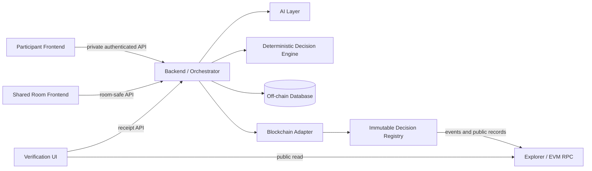

# 시스템 아키텍처

## 컴포넌트 책임과 신뢰 경계

| Component | 책임 | 신뢰 경계 |
|---|---|---|
| Participant Frontend | private input, 확정, proposal action, 개인 receipt | 타인의 데이터를 렌더링하지 않음 |
| Shared Room Frontend | room 진행과 aggregate-safe status | participant별 condition/conflict를 받지 않음 |
| Verification UI | receipt와 public chain record 비교 | HUSH API를 유일한 증거로 취급하지 않음 |
| Backend / Orchestrator | lifecycle, authorization, persistence, 호출, receipt 조립 | Engine 규칙을 대체하거나 자동 승인하지 않음 |
| AI Layer | parsing과 설명만 수행 | 외부의 신뢰되지 않은 dependency |
| Deterministic Decision Engine | 평가, 검색, 점수, 선택 | 계산 권한만 가지며 저장·승인 권한 없음 |
| Database | 암호화된 private record, audit, idempotency | raw input/salt는 authorized off-chain path에만 존재 |
| Blockchain Adapter | 승인된 provenance의 contract 호출과 tx 추적 | source data를 만들거나 변경하지 않음 |
| Smart Contract | immutable public commitment registry | public metadata는 관찰 가능하고 raw value는 보관 금지 |

## 데이터 흐름과 경계

Private flow는 `Participant Frontend → Backend / Orchestrator → Database / AI Layer / Deterministic Decision Engine`이다. raw 자연어, `constraint_value`, private reason, salt, proposal 상세, authorization token은 off-chain에만 남는다. AI에는 현재 사용자의 입력만 전달하며 Shared Room의 데이터 공급원이 되지 않는다.

Public/shared flow는 안전한 aggregate status와 on-chain `decision_room_id`, `participant_pseudonym`, version, commitment, root/hash, transaction provenance, event다. Shared API는 count와 generic message만 반환하며 타인의 `participant_id`, `constraint_id`, `constraint_type`, value, conflict set, proposal을 반환하지 않는다.

On-chain/Off-chain 경계는 승인된 `ConstraintVersion`의 commitment와 deterministic `FinalDecision` provenance를 일방향으로 게시하는 지점이다. public event만으로 private input을 복원할 수 없어야 한다. 외부 dependency는 LLM provider, EVM RPC/broadcaster, public explorer이며 실패 처리는 `10-error-and-fallback.md`를 따른다.

## 권한 규칙

Backend는 canonical input을 Engine에 전달하고 반환값을 보관할 뿐 feasibility, conflict, ranking, score, selection을 변경하지 않는다. Engine은 proposal을 계산할 뿐이며 participant의 명시적 approval만 새 `ConstraintVersion`을 생성한다.
