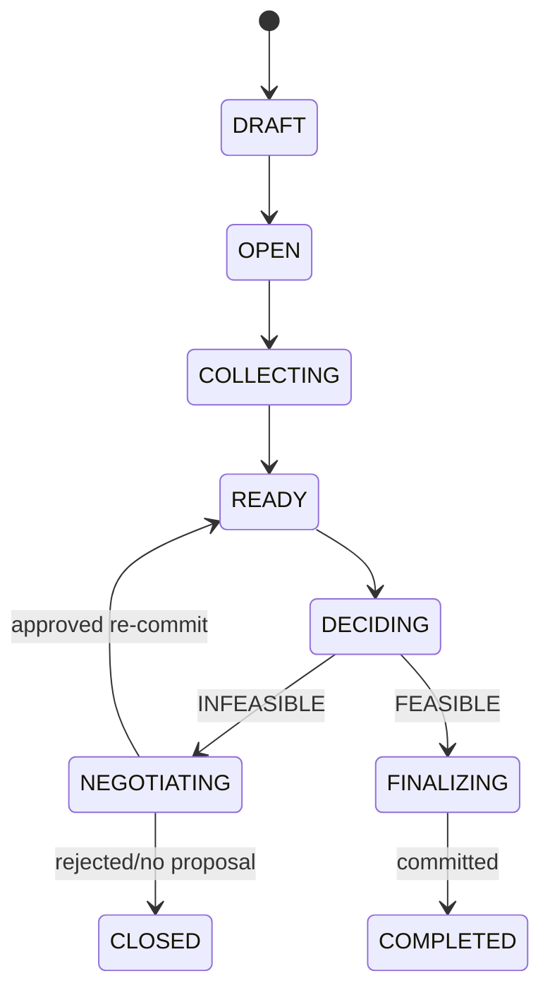
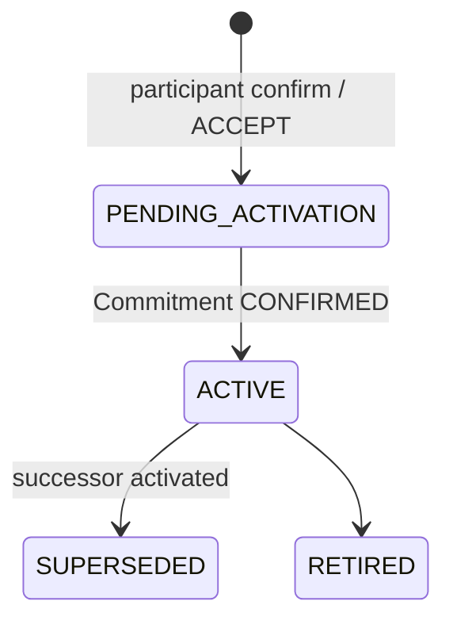

# 상태 머신

모든 transition은 authorization, 현재 version, idempotency를 확인한 단일 transaction에서 기록한다. failure는 이전 유효 state를 보존하며 임의 rollback이나 자동 완화를 하지 않는다.

## `DecisionRoom`

| State | Allowed Transition / Trigger | Precondition·Actor | Side Effect / Failure Behavior |
|---|---|---|---|
| `DRAFT` | `OPEN` / room 생성 완료 | creator | join 허용; 실패 시 `DRAFT` 유지 |
| `OPEN` | `COLLECTING` / 첫 participant join | invited participant | participant 생성 |
| `COLLECTING` | `READY` / completeness 검사 | Backend | `participant_count == required_participant_count`이고 모든 roster participant가 `INPUT_CONFIRMED`이며 `CONSTRAINED`면 eligible input, `EMPTY`면 빈 canonical input을 가지면 전환; 아니면 유지 |
| `READY` | `DECIDING` / decision 실행 | authorized participant 또는 creator | `DecisionRun` 생성 |
| `DECIDING` | `NEGOTIATING` / infeasible | Engine | generic conflict status만 shared |
| `DECIDING` | `FINALIZING` / feasible | Engine | `FinalDecision` 후보 생성 |
| `NEGOTIATING` | `READY` / accepted re-commit confirmed | Backend | atomic activation 뒤 새 eligible version 사용 |
| `NEGOTIATING` | `CLOSED` / 모두 reject 또는 proposal 없음 | authorized actor | 원 version 보존 |
| `FINALIZING` | `COMPLETED` / decision commitment confirmed | Blockchain Adapter | receipt 생성 |
| `COMPLETED`, `CLOSED` | 없음 | terminal | immutable audit 보존 |

## `Participant`

`INVITED → JOINED → ACTIVE → RECEIPT_AVAILABLE` 순서다. `JOINED`는 private session과 `participant_pseudonym`이 만들어진 상태다. `input_status`는 별도로 `PENDING_INPUT → INPUT_CONFIRMED`이며, `input_mode=CONSTRAINED`는 eligible version 하나 이상, `input_mode=EMPTY`는 input confirmation 시 생성한 salted canonical EMPTY `ParticipantInput`을 뜻한다. `ACTIVE` participant는 room roster의 대상이 될 수 있다. room이 `READY` 뒤에는 join/leave를 허용하지 않고, `DECIDING` 이후 roster는 해당 run의 frozen snapshot으로 변하지 않는다. room 종료 전 participant를 삭제하지 않으며 접근 철회는 `REVOKED`로 기록한다. `REVOKED`는 terminal이고 이후 run input이 될 수 없다.

## `Constraint`와 `ConstraintVersion`

| State | Allowed Transition | Trigger / Actor | 조건과 효과 |
|---|---|---|---|
| `PENDING_ACTIVATION` | `ACTIVE` | initial `commitCondition` 또는 successor `supersedeCondition`의 successful mined receipt / Backend | 새 version approval이 존재하고 atomic CAS 전환 성공 |
| `ACTIVE` | `SUPERSEDED` | 후속 version activation / Backend | 같은 atomic transition에서 후속 version이 `ACTIVE`가 됨 |
| `ACTIVE` | `RETIRED` | participant가 room 종료 전 철회 | 해당 version은 다음 run 제외 |
| `SUPERSEDED`, `RETIRED` | 없음 | terminal | 수정 불가 |

`ConstraintVersion` lifecycle과 `Commitment` lifecycle은 분리한다. `Commitment`은 `PENDING → CONFIRMED | FAILED`다. `FAILED` record는 terminal이며 재시도는 새 `Commitment.attempt`를 만든다. initial version은 `commitCondition`의 successful mined receipt로 `ACTIVE`가 된다. `v1 ACTIVE`+`CONFIRMED`에서 `ACCEPTED`가 발생하면 `v2 PENDING_ACTIVATION`+`PENDING`만 만들고 `supersedeCondition` 단일 transaction을 제출한다. 이 transaction은 previous/new version 및 new commitment provenance를 함께 기록한다. 해당 receipt가 `CONFIRMED`될 때 compare-and-set 또는 database transaction으로 v1 `ACTIVE → SUPERSEDED`, v2 `PENDING_ACTIVATION → ACTIVE`, Commitment `PENDING → CONFIRMED`를 원자 전환한다. `REJECTED` proposal 또는 v2 `FAILED`는 v1을 그대로 유지한다.

## `Commitment`

| State | Allowed Transition | Trigger / Actor | 조건과 효과 |
|---|---|---|---|
| `PENDING` | `CONFIRMED` | successful mined receipt / Blockchain Adapter | initial은 `commitCondition`, successor는 new commitment를 포함한 single `supersedeCondition`; successor이면 atomic activation/supersession 수행 |
| `PENDING` | `FAILED` | reverted receipt 또는 확정 게시 실패 / Blockchain Adapter | 연결된 version은 `PENDING_ACTIVATION` 유지; 기존 eligible version 보존 |
| `CONFIRMED`, `FAILED` | 없음 | terminal | 실패 재시도는 같은 version의 새 `Commitment.attempt` 생성 |

`Commitment`은 on-chain 게시 lifecycle일 뿐 사용자 의미 lifecycle이 아니다. `FAILED`는 ConstraintVersion을 `SUPERSEDED`나 `RETIRED`로 바꾸지 않는다. successor `ConstraintVersion`은 new commitment를 담은 single `supersedeCondition` transaction이 successful mined 상태가 되기 전 `ACTIVE`가 될 수 없고 predecessor는 `SUPERSEDED`가 될 수 없다.

## `DecisionRun`, `RelaxationProposal`, `FinalDecision`, `ParticipantReceipt`

`DecisionRun`: `QUEUED → RUNNING → FEASIBLE | INFEASIBLE | FAILED`. 생성 시 roster와 eligible input을 freeze한다. `FEASIBLE`만 `FinalDecision`을 만들고 `INFEASIBLE`만 `Conflict`/proposal 탐색을 시작한다. `FAILED`는 terminal이며 원 input을 변경하지 않는다.

eligibility는 `DecisionRun` 생성 transaction에서 한 번만 검사한다. 생성 이후 version이 `SUPERSEDED` 또는 `RETIRED`가 되더라도 이미 frozen된 run은 immutable snapshot을 계속 사용한다. Engine은 실행 시점의 현재 DB state를 다시 조회해 frozen version을 제외하지 않는다.

`RelaxationProposal`: `PROPOSED → ACCEPTED | REJECTED | EXPIRED`. `ACCEPTED`에는 대상 participant의 `UserApproval`이 필수이며, 새 version commit 실패 시 proposal은 `ACCEPTED`, 새 version은 `PENDING_ACTIVATION`, Commitment는 `FAILED`, room은 `NEGOTIATING`에 남는다. `REJECTED`와 `EXPIRED`는 terminal이다.

`FinalDecision`: `PENDING_COMMITMENT → COMMITTED | COMMITMENT_FAILED`. `COMMITTED`만 shared final result와 receipt를 허용한다. `COMMITMENT_FAILED`는 retry할 수 있으나 선택 값과 provenance는 바꾸지 않는다.

`ParticipantReceipt`: `PENDING → AVAILABLE → VERIFIED | INVALID`. `AVAILABLE`은 private retrieval 가능, `VERIFIED`/`INVALID`는 Verification UI의 비교 결과다. receipt 원본은 불변이며 재검증은 state를 덮지 않고 timestamped result를 추가한다.

## 상태 전환 invariant

- **Invariant A:** 사용자 승인 없이 새 `ConstraintVersion`은 생성하거나 `ACTIVE`로 만들 수 없다.
- **Invariant B:** new commitment를 포함한 successor `supersedeCondition` transaction이 successful mined 상태가 되기 전에는 successor를 `ACTIVE`로 만들거나 predecessor `ACTIVE` version을 `SUPERSEDED`할 수 없다.
- **Invariant C:** successor transaction이 실패하면 predecessor `ACTIVE`+`CONFIRMED` version은 유지된다.
- **Invariant D:** `DecisionRun`은 시작 시 frozen roster와 frozen `participant_inputs`를 가진다.
- **Invariant E:** run 시작 이후 생성된 `ConstraintVersion`은 현재 run에 영향을 주지 않고 다음 run부터 사용한다.
- **Invariant F:** 모든 frozen roster participant는 `input_set_root`에 최소 하나의 frozen `ParticipantInput` representation을 가진다.
- **Invariant G:** `CONSTRAINED` participant의 모든 사용 input은 `ParticipantReceipt.participant_inputs`에서 검증 가능하다.
- **Invariant H:** `EMPTY` participant도 canonical EMPTY entry로 input set inclusion을 검증할 수 있다.
- **Invariant I:** Receipt와 shared API는 다른 participant의 raw private input, private reason, salt를 공개하지 않는다.
- **Invariant J:** participant private API는 해당 participant session만 접근할 수 있고 Shared Room API는 participant-specific relaxation target을 노출하지 않는다.
- **Invariant K:** P0에서 유효한 relaxation이 없거나 모든 proposal이 거절되면 room은 `CLOSED`다. 재입력은 같은 room을 되살리지 않고 새 DecisionRoom에서 시작한다.
