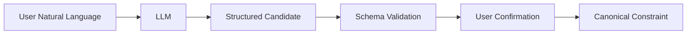

# AI 경계

AI는 `Constraint Parsing`, explanation generation, negotiation message generation을 보조한다. AI output은 신뢰된 domain data가 아니며 schema validation과 participant confirmation 전에는 Decision Engine input이 될 수 없다.

## Constraint Parsing

입력은 현재 participant의 `source_text`, 허용된 `constraint_type` schema, room locale이다. 출력은 `{constraints:[{constraint_type,priority,constraint_value,confidence,explanation}],unparsed_items:[string]}`다. validator는 type allowlist, required field, amount/unit, time format, enum, maximum item 수를 검사한다. 통과한 결과도 사용자 확인 전 draft일 뿐이며 participant가 수정하거나 삭제할 수 있다.

## 설명 생성

입력은 owner가 확정 전인 candidate 또는 자신의 canonical Constraint다. 출력은 해석을 쉽게 설명하는 한국어 text이며 새 field나 결정 권고를 포함하면 안 된다. 다른 participant의 condition, conflict set, private reason은 prompt에 전달하지 않는다. explanation은 reference data가 아니라 UI 보조 text다.

## 협상 메시지 생성

입력은 대상 participant의 `RelaxationProposal`과 Engine이 계산한 `proposed_constraint_value`, `feasible_candidate_count`다. 출력은 현재 값, 제안 값, 수용 시 변화만 한국어로 설명한다. `ACCEPT`를 유도하거나 다른 사용자의 identity/type/value를 언급하면 validation failure다. proposal 자체와 accept/reject 권한은 AI에 없다.

## 검증, fallback, 실패 처리

invalid JSON, schema failure, unsupported condition, prompt injection 의심, timeout, unavailable은 `AI_PARSE_FAILED` 또는 `AI_UNAVAILABLE`로 기록한다. 사용자에게 원문을 재입력하거나 supported schema를 직접 입력하는 fallback을 제공한다. AI 실패는 기존 confirmed Constraint나 commitment를 변경하지 않으며 Decision Engine은 AI 없이 이미 확정된 canonical Constraint만으로 계속 실행할 수 있다.

## Prompt injection과 privacy 규칙

system prompt는 allowlist schema와 data boundary를 고정하고, user text를 instruction이 아닌 untrusted content로 구분한다. tool 호출, external URL fetch, shared-room data access, secret/salt 반환을 허용하지 않는다. raw input 및 model response는 민감 로그로 분류하여 최소 보관하며 운영자 console에 표시하지 않는다. 외부 LLM API가 raw text를 처리할 수 있다는 기획서의 한계는 UI에서 사전에 고지한다.
