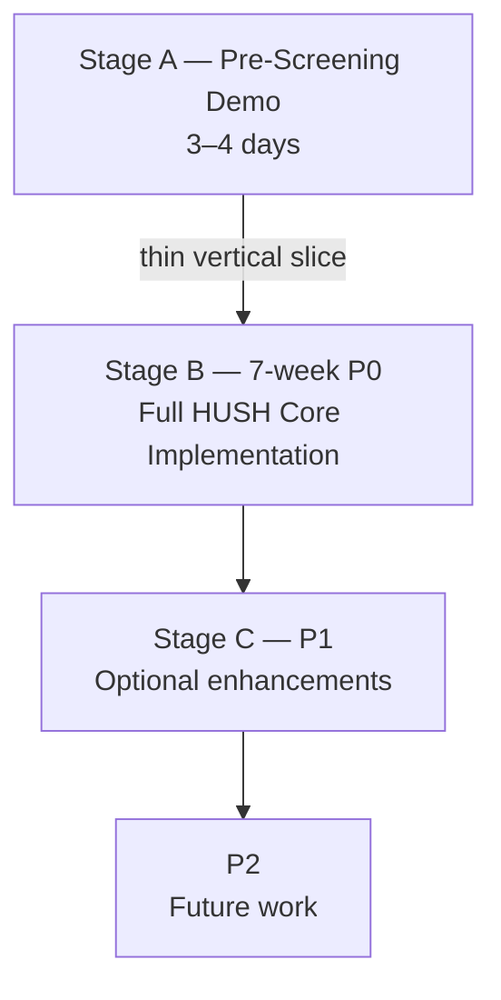

# HUSH 구현 아키텍처 명세

제품 요구사항의 정본은 [HUSH-project-plan.md](../product/HUSH-project-plan.md)이며, 충돌할 경우 기획서가 우선한다. 기존 `00`~`11` 문서는 서류 심사 통과 후 진행할 7주 P0의 구현 계약이다. [12-pre-screening-demo.md](12-pre-screening-demo.md)는 이를 대체하거나 P0 계약을 변경하지 않는 3~4일짜리 thin vertical slice 구현 명세다.

## HUSH Implementation Scope

- **Stage A — Pre-Screening Demo:** 심사위원이 private input, AI 구조화와 사용자 승인, deterministic decision, private relaxation, receipt/verification의 핵심 흐름을 실제로 볼 수 있게 하는 축소 구현이다.
- **Stage B — P0:** 현재 아키텍처가 정의하는 전체 P0를 7주 동안 구현한다. Demo의 생략 사항 때문에 P0 canonical contract가 축소되는 일은 없다.
- **Stage C — P1 / P2:** 아래의 기존 경계를 유지한다.

## 읽는 순서와 문서 책임

1. `00-scope.md`: Stage A와 Stage B의 범위 경계 및 P0 계약
2. `01-system-architecture.md`: 컴포넌트·신뢰·데이터 경계
3. `02-domain-model.md`, `03-state-machine.md`: canonical 모델과 lifecycle
4. `04-api-contract.md`: Frontend와 Backend의 REST 계약
5. `05-decision-engine.md`~`07-blockchain-contract.md`: 계산·AI·검증 경계
6. `08-frontend-flow.md`~`11-implementation-plan.md`: 화면·보호·실패·P0 구현 순서
7. `12-pre-screening-demo.md`: Stage A 전용 구현 명세, P0 대응 관계, Demo 일정

## 정본 lifecycle

`Private Input → AI Structuring → User Approval → Commitment → Decision → Conflict Detection → Minimum Relaxation → Private Negotiation → User Approval → Versioned Re-Commit → Final Decision → Decision Commitment → Participant Receipt → Independent Verification`

## 공통 용어

| Canonical identifier | 의미 |
|---|---|
| `decision_room_id` | 하나의 집단 의사결정을 식별하는 불변 ID |
| `required_participant_count` | Decision 실행에 필요한 room roster의 participant 수 |
| `participant_id` | room 내부 participant를 식별하는 비공개 ID |
| `participant_pseudonym` | on-chain에 기록하는 room별 비식별 pseudonym |
| `constraint_id` | participant가 소유한 논리적 Constraint의 안정적 ID |
| `constraint_version_id` | 불변 ConstraintVersion ID |
| `constraint_version` | 1부터 시작하는 양의 버전 번호 |
| `constraint_value` | Decision Engine이 사용하는 정형화된 비공개 값 |
| `condition_commitment` | 승인된 ConstraintVersion의 Keccak-256 commitment |
| `participant_input_id` | 하나의 ConstraintVersion 또는 명시적 EMPTY input을 식별하는 비공개 ID |
| `participant_inputs` | ParticipantReceipt에서 participant가 제공한 frozen input entry 배열 |
| `input_set_leaf` | DecisionRun-bound ParticipantInput commitment leaf |
| `input_set_root` | DecisionRun 시작 시 freeze한 eligible leaf의 deterministic root |
| `decision_run_id` | 하나의 Engine 실행 요청 및 결과 ID |
| `engine_version`, `engine_code_hash` | 실행 Engine release 식별자 |
| `final_decision_id` | 최종 선택과 provenance의 불변 ID |
| `decision_commitment` | FinalDecision provenance의 Keccak-256 commitment |

JSON field는 lower snake_case를 사용한다. hash는 소문자 `0x` 접두사의 32-byte hex이며 timestamp는 UTC RFC 3339 문자열이다.

## P0/P1/P2 경계

P0는 비공개 입력, AI 구조화와 사용자 확정, deterministic 계산, 비공개 협상, immutable EVM testnet commitment, Participant Receipt 및 독립 검증을 포함한다. P1은 가격 상한 ZK Proof, Merkle `input_set_root`, participant 서명 강화, 협상안 비교 UI다. P2는 DAO, MPC, Local/On-device LLM, 모든 Constraint의 ZK, 복잡한 governance, 기업 연동 및 완전 익명성이다.

## P0 DECISION

**PD-001 — Authentication / participant identity:** QR room invite 뒤 server-issued opaque participant session과 room-scoped opaque `participant_id`를 사용한다. private API는 session과 ownership을 모두 확인한다. wallet login은 P0 필수가 아니며 verification UX 또는 Future Extension에서 선택적으로 연결할 수 있다.

**PD-002 — P0 `input_set_root`:** DecisionRun이 frozen roster의 `participant_inputs`를 확정한 뒤, `CONSTRAINED`의 모든 eligible ConstraintVersion과 `EMPTY`의 canonical input에서 run-bound `input_set_leaf`를 만든다. leaf를 deterministic sort하고 canonical serialization한 뒤 Keccak-256으로 `input_set_root`를 만든다. Merkle Tree와 inclusion proof는 P1이다.

P0 `ParticipantReceipt`은 다중 `participant_inputs`와 root 재계산용 `input_set_leaves`를 제공한다. 이는 제한적인 metadata disclosure이며 raw constraint, private reason, salt, participant identity와 다른 leaf의 직접 mapping은 제공하지 않는다. P1 Merkle proof는 이 전체 leaf set 제공을 제거한다.

**PD-003 — transaction confirmation:** transaction 제출 직후 `Commitment.status`는 `PENDING`이고 `transaction_hash`를 보관한다. successful mined transaction receipt 확인 뒤에만 `CONFIRMED`, reverted receipt면 `FAILED`다. P0는 추가 block confirmation 수를 요구하지 않으며 activation/finalization은 `CONFIRMED` 뒤에만 가능하다.

## OPEN DECISION

없음. 제품 의미를 바꾸지 않는 retry transport, encryption provider, polling 주기 같은 세부사항은 구현 시 IMPLEMENTATION DECISION으로 정한다.
